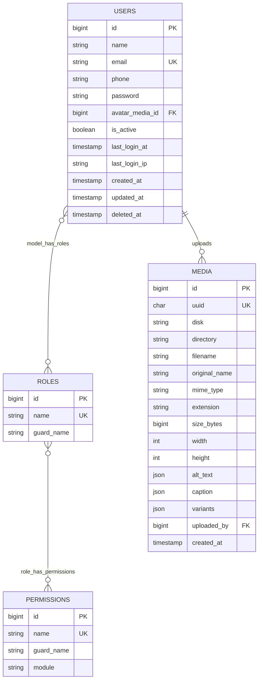
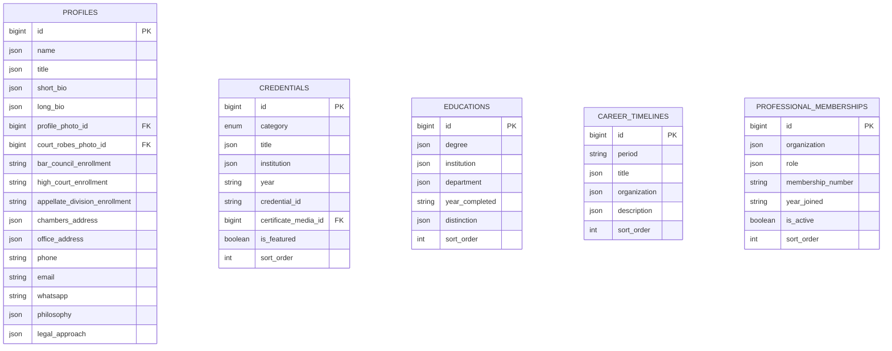
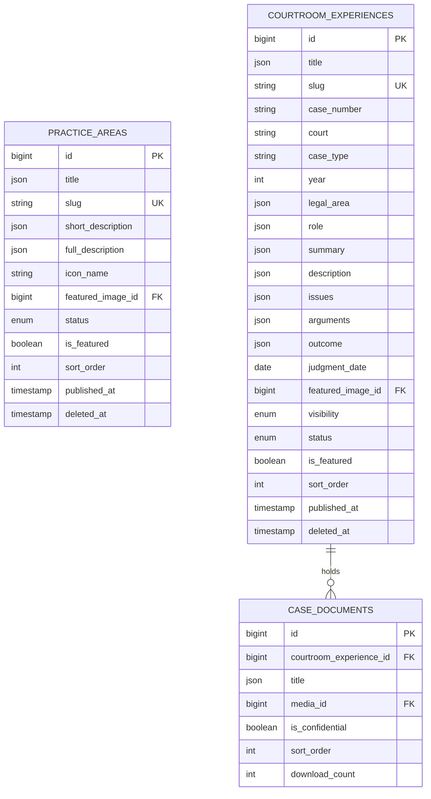
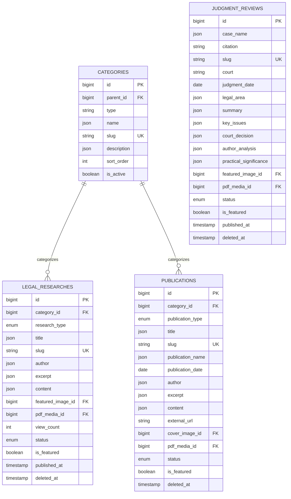
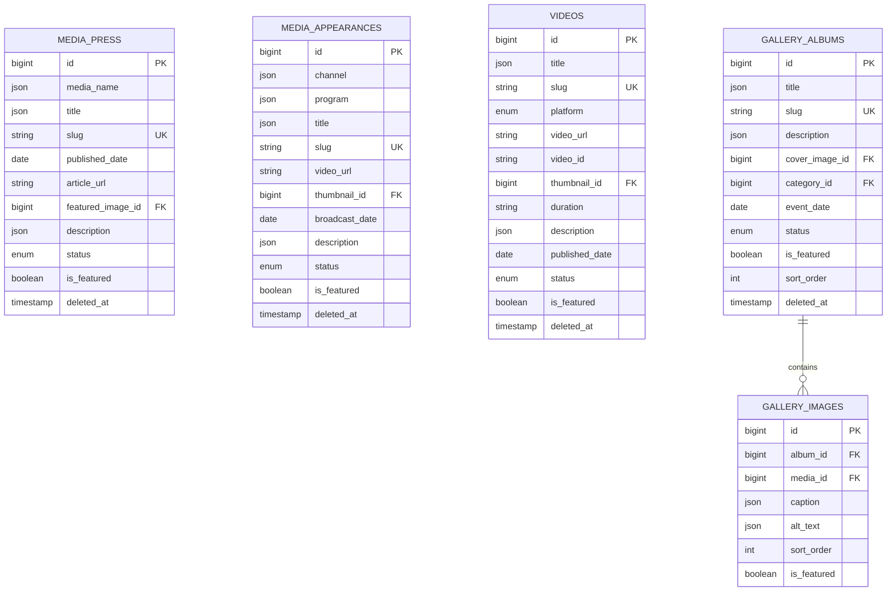
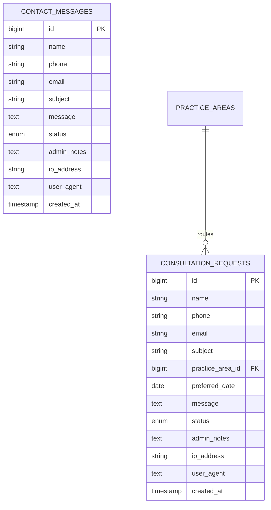
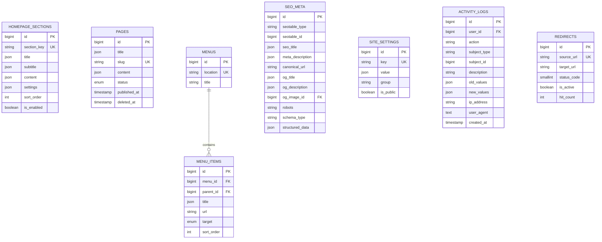

# 03. Database Entity Relationship Diagram (ERD)

**Project:** Nijam Uddin (Haq) — Legal Authority & Portfolio Platform  
**Database:** `nijamuddin_db` (MySQL 8.0.31 InnoDB)  
**Document Version:** 1.0.0 (Phase 1 Final)  
**Lead Coordinator:** Database Architect & Senior Solution Architect  

---

## 1. Complete System Entity Relationship Diagram

```mermaid
erDiagram
    USERS ||--o{ ACTIVITY_LOGS : performs
    USERS ||--o{ MEDIA : uploads
    USERS }o--o{ ROLES : assigned
    ROLES }o--o{ PERMISSIONS : contains

    MEDIA ||--o{ PROFILES : "profile/robe photo"
    MEDIA ||--o{ CREDENTIALS : "certificate"
    MEDIA ||--o{ PRACTICE_AREAS : "featured image"
    MEDIA ||--o{ COURTROOM_EXPERIENCES : "featured image"
    MEDIA ||--o{ CASE_DOCUMENTS : "document file"
    MEDIA ||--o{ LEGAL_RESEARCHES : "cover/pdf"
    MEDIA ||--o{ JUDGMENT_REVIEWS : "cover/pdf"
    MEDIA ||--o{ PUBLICATIONS : "cover/pdf"
    MEDIA ||--o{ MEDIA_PRESS : "thumbnail"
    MEDIA ||--o{ MEDIA_APPEARANCES : "thumbnail"
    MEDIA ||--o{ VIDEOS : "thumbnail"
    MEDIA ||--o{ GALLERY_ALBUMS : "cover image"
    MEDIA ||--o{ GALLERY_IMAGES : "gallery item"
    MEDIA ||--o{ SEO_META : "og image"

    CATEGORIES ||--o{ CATEGORIES : "parent-child"
    CATEGORIES ||--o{ LEGAL_RESEARCHES : classifies
    CATEGORIES ||--o{ PUBLICATIONS : classifies
    CATEGORIES ||--o{ GALLERY_ALBUMS : classifies

    TAGS ||--o{ TAGGABLES : categorizes
    LEGAL_RESEARCHES ||--o{ TAGGABLES : polymorphic
    JUDGMENT_REVIEWS ||--o{ TAGGABLES : polymorphic
    PUBLICATIONS ||--o{ TAGGABLES : polymorphic
    COURTROOM_EXPERIENCES ||--o{ TAGGABLES : polymorphic

    COURTROOM_EXPERIENCES ||--o{ CASE_DOCUMENTS : contains
    PRACTICE_AREAS ||--o{ CONSULTATION_REQUESTS : refers

    GALLERY_ALBUMS ||--o{ GALLERY_IMAGES : contains
    MENUS ||--o{ MENU_ITEMS : organizes
    MENU_ITEMS ||--o{ MENU_ITEMS : "parent-child"

    PAGES ||--o| SEO_META : polymorphic
    PRACTICE_AREAS ||--o| SEO_META : polymorphic
    COURTROOM_EXPERIENCES ||--o| SEO_META : polymorphic
    LEGAL_RESEARCHES ||--o| SEO_META : polymorphic
    JUDGMENT_REVIEWS ||--o| SEO_META : polymorphic
    PUBLICATIONS ||--o| SEO_META : polymorphic
```

---

## 2. Detailed Domain ER Diagrams

### 2.1 Identity, RBAC & Media Storage Core

### 2.2 Profile, Academic Pedigree & Professional Honors

### 2.3 Legal Practice & Courtroom Advocacy

### 2.4 Legal Research, Landmark Judgments & Publications

### 2.5 Media Coverage, Video Broadcasts & Gallery

### 2.6 Client Communication & Intake Inquiries

### 2.7 CMS, Dynamic Homepage, Audit & System

---

## 3. Structural Relationship Cardinality Matrix

| Relationship | Type | Parent | Child | Cascading Action | Business Justification |
| :--- | :--- | :--- | :--- | :--- | :--- |
| **User to Media** | 1:N | `users` | `media` | `ON DELETE SET NULL` | Preserve media when staff accounts are removed. |
| **User to Audit Log** | 1:N | `users` | `activity_logs` | `ON DELETE SET NULL` | Audit trails must remain permanently intact. |
| **Role & Permission** | N:M | `roles` | `permissions` | Pivot cascade | Standard Spatie RBAC integrity. |
| **Media to Models** | 1:N | `media` | Various | `ON DELETE SET NULL` | Removing an image variant doesn't destroy content. |
| **Category to Items** | 1:N | `categories` | Research / Pubs | `ON DELETE SET NULL` | Deleting category does not destroy papers. |
| **Tags to Items** | Poly N:M | `tags` | `taggables` | `ON DELETE CASCADE` | Polymorphic tags cleanup on tag deletion. |
| **Case to Documents** | 1:N | `courtroom_experiences` | `case_documents` | `ON DELETE CASCADE` | Case documents belong strictly to their case. |
| **Album to Images** | 1:N | `gallery_albums` | `gallery_images` | `ON DELETE CASCADE` | Removing album cleans its image relationships. |
| **Menu to Items** | 1:N | `menus` | `menu_items` | `ON DELETE CASCADE` | Menu deletion cleans all nested items. |
| **Entity to SEO** | Poly 1:1 | Entities | `seo_meta` | Application Managed | SEO records attach cleanly to any routable entity. |
