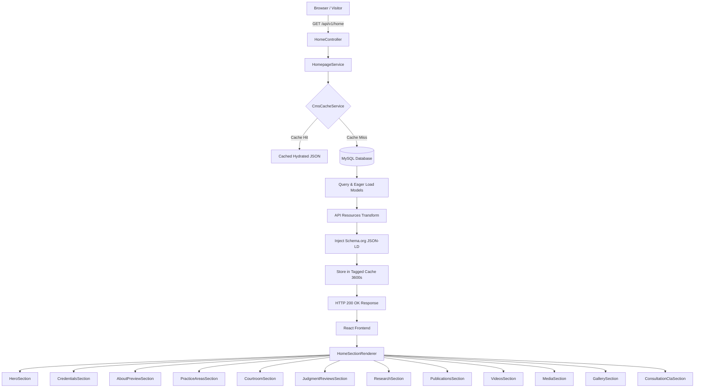

# Phase 16 — Homepage Architecture Documentation

## 1. Architectural Vision & Purpose
The Homepage for **Advocate Nijam Uddin (Haq)** is the central institutional gateway to the platform. It expresses an authoritative, restrained, and editorial design language worthy of a seasoned Supreme Court practitioner.

Rather than being a static assemblage of hardcoded text blocks, the homepage operates as a **dynamically orchestrated CMS composition**. All visible components, ordering, item counts, and featured highlights are driven by a single, high-performance, cached API contract (`GET /api/v1/home`).

---

## 2. Core Architectural Pillars

### 2.1 Single Hydrated Endpoint (`GET /api/v1/home`)
To eliminate N+1 public roundtrips (which would degrade LCP, increase server load, and cause cumulative layout shifts), the platform provides a unified response envelope via `App\Services\HomepageService`.
- **Eager-loading**: Relations (`featuredImage`, `category`, `practiceArea`, `certificate`, `profilePhoto`, `courtRobesPhoto`) are selectively preloaded.
- **Selective Projections**: Only summary columns required for homepage presentation are queried (heavy rich-text bodies, internal admin notes, and private files are excluded).
- **Public Scoping**: Only records with `status = 'published'` and `visibility = 'public'` can ever reach the public homepage.

### 2.2 CMS Section System & Dynamic Ordering
The layout is governed by the `homepage_sections` table:
- **`is_enabled`**: When set to `false`, the section is omitted from the API envelope. The React application does not render it and does not reserve layout space.
- **`sort_order`**: Reordering sections in the CMS Admin directly changes the order of the `sections` array in the API, which dynamically dictates the top-to-bottom rendering sequence in `HomeSectionRenderer.tsx`.
- **`settings`**: Provides section-level parameters such as `limit`, layout flags, and contextual labels.

### 2.3 Strict Content Safety & Empty State Logic
- **No Placeholders / Fake Data**: The homepage NEVER creates mock cases, invented judgments, or simulated credentials.
- **Automatic Section Hiding**: If a domain module contains zero published, public, or featured records (e.g. no published courtroom experiences exist in the database), the section gracefully evaluates to `null` and remains hidden.

---

## 3. High-Level Data Flow

---

## 4. Bilingual Support (EN / BN)
The platform integrates standard header-based (`Accept-Language: bn` / `Accept-Language: en`) and query-based (`?lang=bn`) locale switching.
- Translatable Eloquent model attributes resolve automatically using `HasTranslations`.
- Static interface copy is managed with strict 1:1 key parity between `frontend/src/i18n/en.ts` and `bn.ts`.
- The helper `resolveLocalized(value, locale)` provides deterministic fallbacks without rendering missing tokens.
